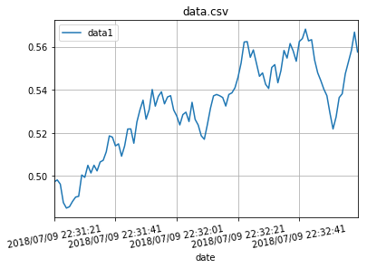
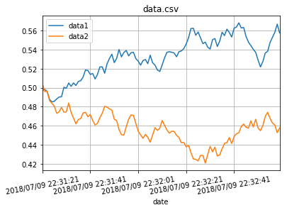

# python-csv-to-line-graph

Create a line graph from a csv file. 

Jupyter Notebook: [python-csv-to-line-graph.ipynb](./python-csv-to-line-graph.ipynb)


```python
# Generate a fake csv file.

import datetime
import random

file = open("data.csv", "w")

# header
file.write("date,data1,data2\n")

# data
date = datetime.datetime.now()
data1 = 0.5
data2 = 0.5

for i in range(100):
    date = date + datetime.timedelta(seconds=1)
    data1 = data1 + random.uniform(-0.01,0.01)
    data2 = data2 + random.uniform(-0.01,0.01)
    
    file.write(date.strftime("%Y/%m/%d %H:%M:%S"))
    file.write(",")
    file.write(str(data1))
    file.write(",")
    file.write(str(data2))
    file.write("\n")

file.close()
```


```python
# A function that draws a line graph from a csv file.

%matplotlib inline
import pandas as pd
import matplotlib.pyplot as plt
import os

def draw_line_graph_from_csv(file_name, x_axis, y_axes=None):
    df = pd.read_csv(file_name)
    filter = [x_axis] + y_axes

    title = os.path.basename(file_name)
    df[filter].plot(x=x_axis, title=title, grid=True, rot=10, figsize=(6, 4))
```


```python
draw_line_graph_from_csv('data.csv', 'date', ['data1'])
```





```python
draw_line_graph_from_csv('data.csv', 'date', ['data1', 'data2'])
```



